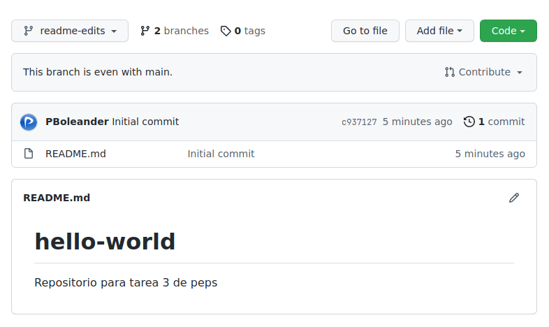

# tarea3-peps

## Pascual Barrer Ferrer

---

## Hello world GitHub

Para esta práctica se va a crear un repositorio llamado `hello-world` en GitHub y a trabajar en una rama para luego hacer un `pull request` a la rama principal (`main`).

### Creando un repositorio

Para empezar y habiéndonos logueado en GitHub iremos a la esquina superior derecha de la ventana y desplegaremos el menú que hay en el botón con un + para, ahí, seleccionar New repository, tal como muestra la imagen:

En la siguiente pantalla nos aparecen una serie de opciones a rellenar. Las rellenamos tal como muestra la imagen. Lo más importante es que el nombre del repositorio no esté ya en uso porque, en caso de estarlo, no nos dejará emplearlo de nuevo. Otra cosa a tener en cuenta es marcar la opción de Add a README file ya que, así, nos ahorraremos el trabajo de hacerlo manualmente. Al estar satisfechos con las opciones elegidas clicamos en Create repository.

Se nos creará el repositorio y nos aparecerá en la siguiente pantalla:

### Realizando cambios en los archivos del repositorio

Si deseamos cambiar algo del repositorio (archivos, carpetas, cambiar nombres, etc.) podemos trabajar en una rama aparte ya que, generalmente, la rama `main` está reservada para la producción y no es conveniente hacer los cambios directamente en ella por si surgen problemas, además de que no se suele tener permisos para hacerlo en el mundo laboral.

Así pues, para crear una nueva rama nos dirigimos a la parte superior, justo encima de la lista de archivos (en nuestro caso, sólo el README), donde dice `main` en un desplegable. Lo desplegamos y escribimos el nombre de la nueva rama que queremos crear y pulsamos `Enter`.

Al crearla nos dirige automáticamente a ella. Como vemos no hay diferencia alguna con la principal ya que, al crearse una rama, se hace una copia de todo lo que hay en `main`.

Si pulsamos sobre el archivo README.md en el listado iremos a una nueva ventana en la que veremos su contenido junto con una barra de herramientas como la que se muestra en la imagen. Si pulsamos sobre el icono del lápiz que hay a la derecha de la pantalla...

... se nos abrirá un editor de texto en el que podremos cambiar el contenido del archivo como si se tratara de un bloc de notas. Añadimos algo de información sobre nosotros y...

... en la parte inferior de la ventana tenemos una sección que pone Commit changes con una serie de campos a rellenar. La más importante es la del mensaje de commit que servirá para identificarlo fácilmente. Lo rellenamos con algo que sea aclaratorio de lo que se ha hecho y pulsamos sobre el botón verde Commit changes.

Al hacerlo nos devuelve a la pantalla principal de la rama en la que estamos:

Si cambiamos a la principal (`main`) vemos que está intacta como pretendíamos conseguir.

### Pasando los cambios de la rama nueva a la principal

Si queremos que los cambios se vean reflejados en la rama principal deberemos hacer un `pull request`. Volvamos a nuestra rama de trabajo (`readme-edits`) y en la barra superior hagamos clic en la pestaña Pull requests. Una vez allí, pulsamos sobre el botón verde que dice New pull request.

Nos aparecerá una pantalla donde deberemos elegir qué ramas comparar. Pulsamos sobre nuestra rama de trabajo...

... y nos muestra una nueva pantalla donde se enumeran todos los cambios que existen entre las dos ramas. Si al comprobar los cambios estamos convencidos de que nuestro trabajo puede pasar a la rama principal clicamos en el botón verde Create pull request.

Nos aparecerá una nueva ventana en la que podremos añadir un comentario explicando un poco los cambios realizados, el porqué o, incluso, un pequeño comentario al revisor que nos tendrá que dar el visto bueno o rechazar el `pull request`. Cuando hemos acabado clicamos Creta pull request.

Se mostrará una nueva pantalla con el `pull request` creado. En condiciones normales de trabajo nosotros no podríamos aceptarlo y fusionarlo con la rama `main` pero como que este repositorio es nuestro y sólo de prueba, sí podemos. Pulsamos en Merge pull request.

Nos saldrá un nuevo mensaje en el que tendremos que confirmar que realmente queremos fusionar las dos ramas. Damos a Confirm merge y ya estará hecho.

En la siguiente imagen podemos ver como el `merge` se ha realizado correctamente. Además, nos la opción de borrar la rama `readme-edits` que ya no es necesaria ya que ambas son iguales ahora. Si clicamos en el botón Delete branch borraremos la rama de trabajo y nos quedaremos sólo con la `main`.

Nos aparecerá un mensaje informándonos de que la rama ha sido borrada y, en caso de querer, nos da la opción de restaurarla aunque éste no es nuestro caso.

Si vamos a la pantalla principal del repositorio vemos como, ahora, el `main` está justo como estaba nuestra anterior rama ya borrada. Todos nuestros cambios han sido añadidos a la rama principal.

Sólo para comprobar podemos desplegar la lista de ramas y vemos como, efectivamente, la rama `readme-edits` ya no se encuentra disponible.

